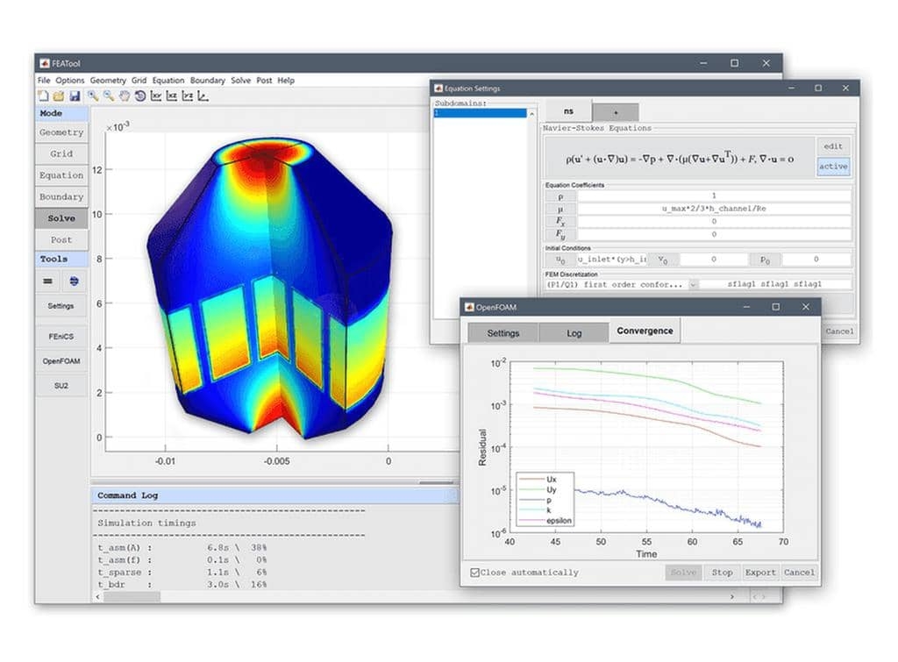

FEATool Multiphysics - _Physics Simulation Made Easy_
=====================================================

About
-----

[**FEATool Multiphysics**](https://www.featool.com) (short for
<b>F</b>inite <b>E</b>lement <b>A</b>nalysis <b>Tool</b>box), is a
fully integrated simulation platform for modeling all types of coupled
physics phenomena, continuum mechanics, and engineering problems.

By providing a truly **easy to use** and integrated **all-in-one**
simulation platform for multi-physics analysis, makes _FEATool_ an
ideal simulation and modeling tool for everyone from students learning
mathematical modeling, to researchers and engineers wishing to explore
new ideas in a **no fuss**, simple, and convenient way.

[Features](https://www.featool.com/featool-multiphysics-features)
--------

- Very easy to use Graphical User Interface (GUI)
- Built-in and fully integrated tools for
  + 1D, 2D, and 3D geometry and CAD modeling
  + Automatic mesh generation
  + State-of-the-art physics solvers
  + Post-processing and visualization
- Pre-defined equations for
  + [Heat and Mass Transfer](https://www.featool.com/multiphysics#heat-and-mass-transfer)
  + [Fluid Dynamics (CFD)](https://www.featool.com/cfd-toolbox)
  + [Structural Mechanics](https://www.featool.com/multiphysics#structural-mechanics)
  + [Electromagnetics](https://www.featool.com/multiphysics#electromagnetics)
  + [Classical PDE](https://www.featool.com/multiphysics#partial-differential-equations)
- One-click seamless integration to several _state-of-the-art_ physics solvers
  + [FEniCS (FEA/Multiphysics)](https://www.featool.com/doc/fenics.html)
  + [OpenFOAM® (CFD)](https://www.featool.com/doc/openfoam.html)
  + [SU2 (CFD)](https://www.featool.com/doc/su2.html)
- [User-defined and custom PDEs](https://www.featool.com/doc/physics.html#phys_ce)
- Easy equation and expression parser (enter equations and coefficients
  _like writing equations on paper_ without any programming)
- Process, export, and share results and data online with
  [ParaView and Plotly web plots](https://www.featool.com/web-plots)
- Save and export models in
  + Binary file format
  + Python FEniCS simulation scripts
  + MATLAB® m-file script format
  + GUI playback script format
- Fully programmable and scriptable with Python and MATLAB®
  (including support for integration and embedding of
  simulation apps in custom applications and toolboxes)

[System Requirements](https://www.featool.com/doc/quickstart.html#prereq)
-------------------

_FEATool_ is a fully integrated simulation environment, which has been
tested and verified to work with 64-bit Windows, Linux, and MacOS
operating systems with a minimum of 4 GB RAM memory.

[Installation](https://www.featool.com/doc/quickstart.html#install)
------------

In order to use _FEATool_, the software must first be installed on the
intended computer system. It is recommended to first uninstall
previous versions before installing/upgrading to a newer version.

Please follow the steps below to install _FEATool_ as a stand-alone
app, or as a MATLAB® toolbox. The installers can be downloaded
directly from the
[FEATool releases](https://github.com/precise-simulation/featool-multiphysics/releases/latest)
and installed manually, or installed from the MATLAB® APPS and Add-On
Toolbar as a toolbox.

  

### Stand-Alone App Installation

Use the steps below to install the app in stand-alone mode

1) First download the installer for your operating system

    + [**FEATool Windows Installer**](https://github.com/precise-simulation/featool-multiphysics/releases/latest/download/FEATool_Multiphysics_install.exe)

    + [**FEATool Linux Installer**](https://github.com/precise-simulation/featool-multiphysics/releases/latest/download/FEATool_Multiphysics.install)

2) Save it to a directory and run the installer. This will first
download and/or install the application runtime if required (which may
require up to 10 GB space to install), and then the program file will
be extracted.

3) When everything has been installed, run the program file to start
_FEATool_. Please be patient as the application runtime can take some
time to start.

### MATLAB® Toolbox Installation

Follow the steps below to install _FEATool_ as a MATLAB® toolbox, and
to enable running MATLAB® simulation m-scripts

1) Download the
   [FEATool_Multiphysics.mlappinstall](https://github.com/precise-simulation/featool-multiphysics/releases/latest/download/FEATool_Multiphysics.mlappinstall)
   toolbox installation file.

2) Then start MATLAB®, press the **APPS** toolbar button,
   and select the **Install App** button.

3) When prompted to choose a toolbox file to install, select the
   **FEATool_Multiphysics.mlappinstall** file and press **OK**.

4) Press the **Install** button if prompted to _"Install to My Apps"_.

Once the toolbox has been installed, an app icon will be available in
the _APPS_ toolbar to start the _FEATool_ GUI. (Note that MATLAB® may
not show or give any indication of the toolbox installation progress
or completion.)

[Tutorials and Examples](https://www.featool.com/doc/quickstart.html#tutorials_and_examples)
----------------------

Automated modeling tutorials and examples for various multi-physics
applications can be selected and run from the **File** > **Model
Examples and Tutorials** menu option in the GUI.

Example script files and simulation models are also available in the
[_examples folder_](https://github.com/precise-simulation/featool-multiphysics/tree/master/examples)
of the _FEATool_ program directory. Moreover, new tutorials and
articles are frequently published on the
[FEATool blog & technical articles](https://www.featool.com/articles).

[Basic Use](https://www.featool.com/doc/quickstart.html#qs_work)
---------

_FEATool_ and the GUI has been specifically designed to be as easy to
use as possible, and making learning multiphysics simulation by
experimentation easy.

The standard modeling process is divided into six different steps or modes

- **Geometry** - Definition of the geometry to be modeled
- **Grid**     - Subdivision of the geometry into smaller grid cells
                 suitable for computation
- **Equation** - Specification of physics, material parameters, and coefficients
- **Boundary** - Boundary conditions specify how the model interacts
                 with the surrounding environment (outside of the geometry)
- **Solve**    - Solution and simulation of the defined model problem
- **Post**     - Visualization and postprocessing of simulation results

These modes can be accessed by clicking on the corresponding buttons
in left hand side _Mode_ toolbar. Each mode has specialized and
different _Tools_ available in the toolbar that will be activated when
selected. Additional and advanced mode options are also be available
in the mode menus.

Basic use and how to set up and model coupled fluid flow and
temperature in a heat exchanger is explained in the
[linked video tutorial](https://youtu.be/TBfVWgYbGTw)
(click on the image below to start the tutorial).

  

Documentation
-------------

The
[FEATool Documentation](https://www.featool.com/doc)
is available online, and also by selecting the corresponding option in
the _Help_ menu of the GUI.

License
-------

(C) Copyright 2013-2022 by Precise Simulation Limited.
All Rights Reserved.

FEATool Multiphysics™ is a trademark of Precise Simulation
Limited. MATLAB® is a registered trademark of The MathWorks,
Inc. OPENFOAM® is a registered trade mark of OpenCFD Limited, producer
and distributor of the OpenFOAM® software. All other trademarks are
the property of their respective owners. Precise Simulation and its
products are not affiliated with, endorsed, or sponsored by these
trademark owners.

The license agreement for using FEATool Multiphysics™ is included with
the distribution and can also be viewed by selecting
_About FEATool..._ > _License Agreement_ from the _Help_ menu in the
application.

Carefully read the license terms and conditions before installing or
using the programs or documentation. Installing or using the programs
means you have accepted and agree to be bound by the terms and
conditions of this agreement. if you do not accept them, uninstall,
remove and completely delete the programs and documentation.
